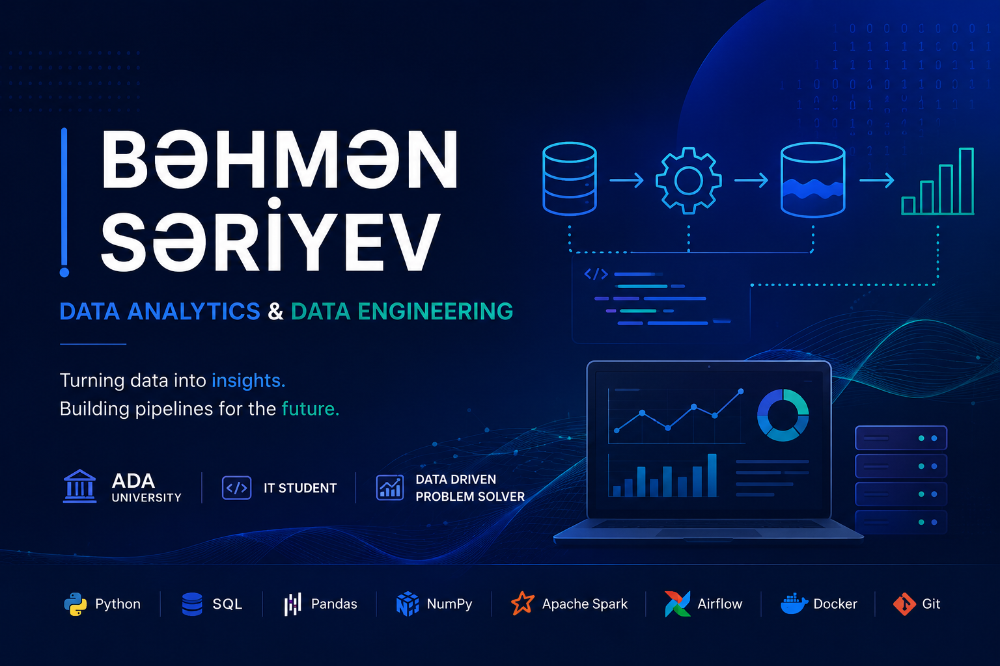

# Welcome to My GitHub Profile! 🚀

## 👨‍💻 About Me
IT Student at ADA University

- 📊 Interested in data-driven decision making
- 🛠 Learning SQL, Python, and data processing
- 📈 Exploring data visualization and ETL pipelines
- 🚀 Building projects to improve analytical skills

## 🛠 Skills
- Java
- C
- Python
- SQL
- Git & GitHub

## 📫 Contact
- LinkedIn: www.linkedin.com/in/bahmansariyev
- Email: behmensariyev44@gmail.com
